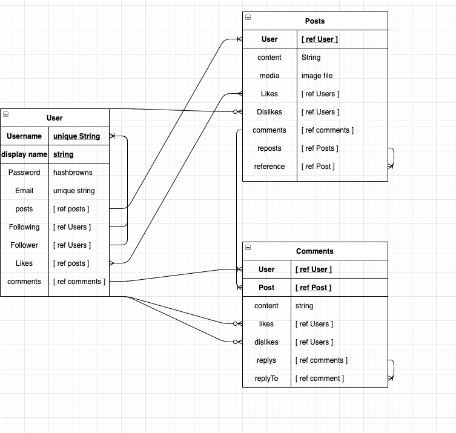

I am building a Twitter clone, I have not named it yet and seggustions are welcome.  In this time I expect to have users that can tweet and comment on other tweets. Users will be able to follow others of course. I would like to try and implement direct messaging and the cherry on top is a react refactor when I am content with the functionality and look of the ejs version.

MVP User story

1   user can see the home page and nothing more till they create an accound or sign in, once done the user can navigate to their profile page and see their posts, liked posts, links to followers and following. User can upload an icon and a cover photo for the header of their profile

2 User can make a tweet and react to posts with like or dislike, User can edit their own posts and remove them. User will see posts of the people they follow, on the home page, in order of post time. user can click on the tweet to see the posts show page 

stretch: retweet and quote posts

3 user will now actually enjoy useing the features above as the buttons they click are full of color and their pictures are nicely sized correctly 

Bonus User story 

4   User  can comment on posts and react to comments with a like or dislike, user can edit and delete theirown comments. comments appear on the posts show page in order of time, (bonus) with the exception of the comments with the top three likes, they will be pinned to the top.

stretch: reply to comments 

5   User can navigate to messages section and send a message to other users, after conversation is established the user can go back to it on the main messages page

    show last message in string inside of the all messages page

6 Refactor to react 

# TIMELINE  
As of now I think I should have the first sprint done by the end of the day tomorrow and then the second should come by the end of the day thrusday at the latest. From then I'll style my but off till I'm content with how it looks. I have no Idea how long that is going to take me, I'm not so good at it so it could be a while but sometimes I surprise myself.  Once it looks nice. which I will plan on taking till Sunday night.  This far out gets really tough, but I don't think comments will take too long, and the styling shouldn't be too much.
DM's... I'm not sure how to do them so I don't know how long it would take. Refactoring to react is something I am planning on doing after the course, I don't think I'll be at a point where I'll want to refactor by next friday. 

The Wireframes are hand drown and horrible so I will add some screen shots of the page later

